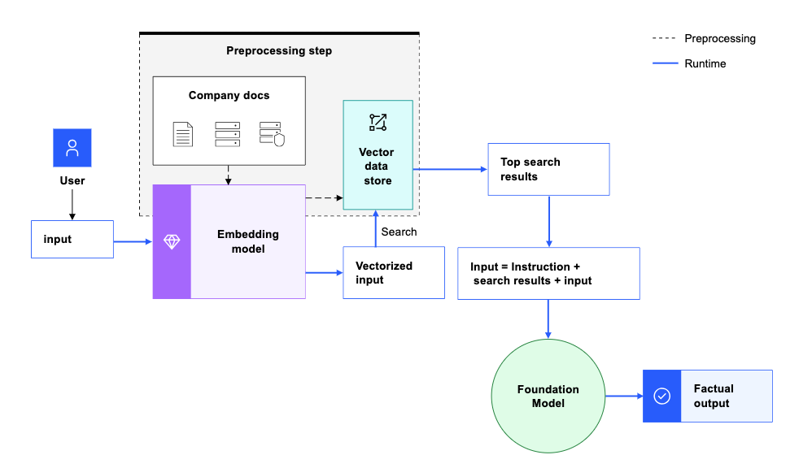

# langchain-handson
langchain handson

```bash
pip install ibm_watson_machine_learning python_dotenv  
pip install langchain_community  
pip install wget 
pip install chroma
pip install langchain
pip install ibm_watsonx_ai 
pip install -qU langchain-ibm
pip install pypdf
pip install sentence-transformers
pip install -U langchain-huggingface
pip install tensorflow_hub
pip install tensorflow_text
pip install faiss-cpu
```

임베딩 모델을 사용하여 문장이나 구절의 의미를 파악하는 텍스트 임베딩을 생성하면 검색 증강 생성 작업에 도움이 됩니다.

검색 증강 생성(RAG)은 기초 모델 프롬프트가 외부 소스의 지식으로 증강되는 기술입니다. 텍스트 임베딩을 사용하여 더 높은 품질의 관련 정보를 찾아 프롬프트에 포함시켜 기초 모델이 사실적으로 답할 수 있도록 도울 수 있습니다.

다음 다이어그램은 임베딩이 지원되는 검색 증강 생성(RAG)) 패턴을 보여줍니다.



임베딩이 지원되는 검색 증강 생성 패턴은 다음 단계를 포함합니다:

1. 콘텐츠를 텍스트 임베딩으로 변환하여 벡터 데이터 저장소에 저장합니다.
2. 동일한 임베딩 모델을 사용하여 사용자 입력을 텍스트 임베딩으로 변환합니다.
3. 지식창고에서 유사성 또는 시맨틱 검색을 실행하여 사용자의 질문과 관련된 콘텐츠를 찾습니다.
4. 가장 관련성이 높은 검색 결과를 프롬프트에 컨텍스트로 가져와 "다음 구절의 정보만 사용하여 다음 질문에 답하세요"와 같은 지침을 추가합니다.
5. 결합된 프롬프트 텍스트(지시 사항 + 검색 결과 + 질문)를 기초 모델에 보냅니다.
6. 기초 모델은 프롬프트의 문맥 정보를 사용하여 사실에 입각한 답을 생성합니다.

