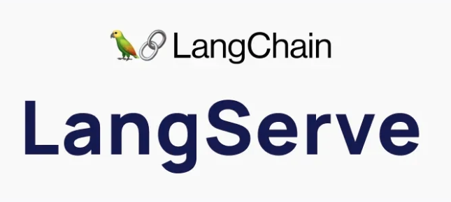

## LangServe 
watsonx.ai와 langserve를 integration 하여 llm 애플리케이션 서비스를 제공하는 lab입니다.



langserve는 OpenAI에서 개발한 오픈소스 언어 모델 서빙 라이브러리입니다. 이 라이브러리는 머신러닝 모델을 쉽게 API로 제공할 수 있도록 설계되었으며, 다양한 자연어 처리 모델을 서빙하고 관리하는 데 유용합니다.

주요 특징과 기능은 다음과 같습니다:

- 모델 관리: langserve는 여러 개의 모델을 관리하고 동시에 서빙할 수 있는 기능을 제공합니다. 각 모델은 독립적으로 설정되어 있어, 다양한 자연어 처리 작업에 대응할 수 있습니다.

- 유연한 API: REST API를 통해 모델에 접근할 수 있으며, 이를 통해 다른 서비스나 애플리케이션에서 쉽게 통합할 수 있습니다.

- 성능 최적화: langserve는 모델 서빙의 성능을 최적화하기 위해 다양한 기술을 사용합니다. 예를 들어, 병렬 처리와 요청 처리 속도 향상을 위한 최적화가 포함될 수 있습니다.

- 다양한 언어 모델 지원: OpenAI의 다양한 언어 모델들을 langserve를 통해 서빙할 수 있습니다. 예를 들어, GPT 시리즈와 같은 모델들이 포함될 수 있습니다.

- 확장성: 대규모 서비스에 적합하도록 설계되어 있어, 수백 개 이상의 요청을 처리할 수 있는 확장성을 지원합니다.


## Downgrade pydantic module
```bash
pip install pydantic==1.10.13
```